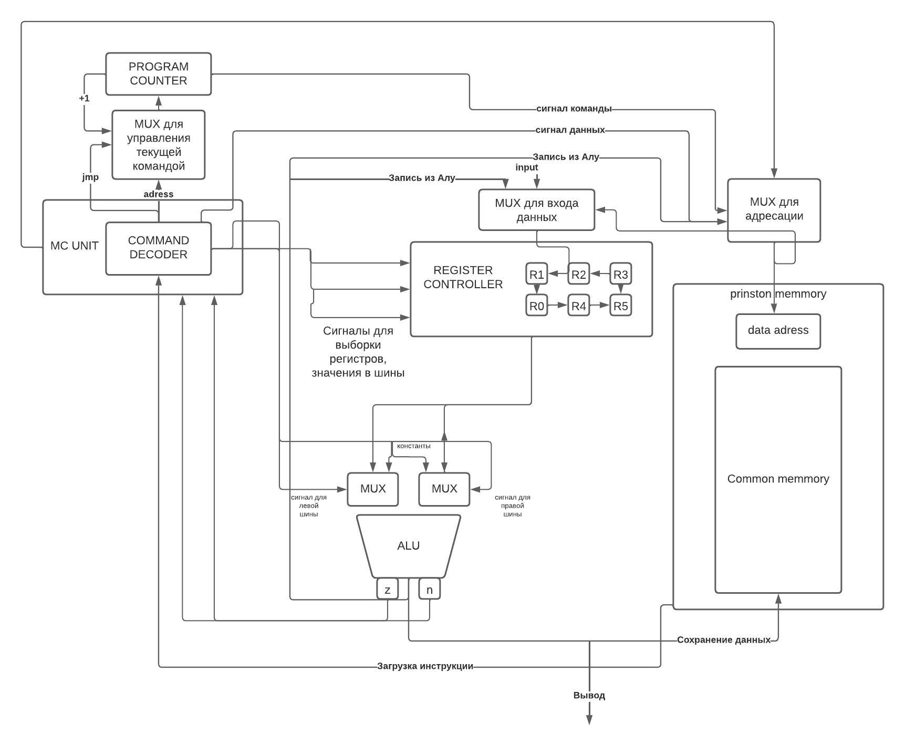

## Вариант

`lisp | risc | neum | mc | tick | struct | stream | port | pstr | prob2 | pipeline`

## Язык программирования

### Синтаксис

    s-expr ::= list | s-expr s-expr  
    list ::= "(" function args")"  
    args ::=  word | number | list 
    function ::= math_operation | operation
    math_operation ::= "!=" | "*" | "+" | "-" | "/" | "%" | "=" | > | < 
    operation ::= var | setvar | loop | if | return-from | printint | printstr | printc
    letter ::= "a" | "b" | ... | "z" | "A" | ... | "Z"
    word ::= letter | letter word
    digit ::= "1" | "2" | ... | "9" | "0"
    number ::= digit | digit number

* `var arg1 arg2` - объявляет переменную `arg1` и присваивает ей начальное значение `arg2`
* `setvar arg1 arg2` - присваивает объявленной переменной `arg1` новое значение `arg2`
* `loop <label>` - бесконечный цикл, может иметь свою метку `<label>` (опционально)
* `return-from <target-label>` - безусловный переход на следующее выражение после выражения, на которое указывает
  целевая метка `<target-label>`
* `if (cond) (then block) (else block)` - оператор ветвления (else block - опционально)
* `+ | - | * | / | % arg1 arg2...<argn>` - арифметические операции над аргументами, минимальное кол-во аргументов: 2
* `!= | = | < | > arg1 arg2`- операторы сравнения, принимают два аргумента
* `printint arg` - вывод целого числа
* `printc arg` - вывод символа
* `printstr arg` - вывод строки
* Типы данных - целочисленные переменные, строки, константы

## Архитектура процессора

Краткая сводка, основные модули архитектуры:

1. ControlUnit - управление и симуляция работы процессора, связующее звено
2. DataPath - управление сигналами
3. MCUnit - декодирование команд и их исполнение с потактным подсчетом.
4. CommonMemory - отвечает за хранение, загрузку данных памяти. Принстонская архитектура.
5. ALU - вычисления АЛУ.

### ControlUnit

* Общее управление
* Первая точка запуска работы

### CommonMemory
Память разделена на сегменты данных и команд, 
1. первые 50 - переменные, 
2. следующие 50 - строки. 
3. Команды - с 100.

* адресуется через регистр `data_address`, может быть изменён:
    * из регистра `program counter -> instr_addr`
    * из декодера команд `pointer_of_indirect_addressing`
    * из АЛУ
* можно писать:
    * из АЛУ
* можно читать:
    * в декодер команд
    * в регистры общего назначения

### DataPath

Сигналы (обрабатываются за один такт, реализованы в виде методов класса):

* `set_left_bus_signal` - передать значение из регистра по левой шине
* `set_right_bus_signal` - передать значение из регистра по правой шине
* `set_left_alu_input_signal` - выбрать источник данных для левого входа алу
* `sel_right_alu_input_signal` - выбрать источник данных для правого входа алу
* `sel_reg` - выбрать регистр для записи и источник данных
* `sel_addr_src` - выбрать источник данных для регистра `data_address`
* `write` - записать значение из алу в память
* `input` - прочитать символ из регистра ввода в выбранный регистр общего назначения
* `output` - передать данные из алу в регистр вывода

### MCUnit

* Кодирование команд из json инструкций в команды
* Декоидрование в opcode и аргументы. Особенность - Машинное слово - 32 бита, декодирование происходит через маску. 5
  бит для команды, по 13 для аргументов arg1 arg2.
* Трансляция команды в последовательность сигналов: `execute`

### ALU

* `execute_alu_op` - выбор операции в алу
* `set_zero`- выставить `zero` флаг в соответствии со значением в алу
* `set_neg`- выставить `neg` флаг в соответствии со значением в алу
* `l_alu` - регистр левого операнда, может принимать данные:
    * из регистров общего назначения по `l_bus`
    * константы из декодера команд `l_const`
* `r_alu` - регистр правого операнда, может принимать данные:
    * из регистров общего назначения по `r_bus`
    * константы из декодера команд `r_const`
* `alu` - регистр результата

  [//]: # TODO архитектура так решила()
* Каждая команда несет фиксированное количество тиков.
  Управляющий сигнал команд:
* `latch_program_counter` -- сигнал для обновления счетчика команд в зависимости от значения на выходе
  мультиплексора `sel_next`

## Транслятор

Этапы трансляции кода в набор json инструкций:

1) Проверка парности скобок
2) Исходный код преобразуется в набор термов
3) Функции преобразуются в последовательность инструкций
4) Переменные заносятся в словарь, в функциях заменяются на адреса
5) Согласно архитектуре варианта - распределение регистров для инструкций. Количество - 6.

На выходе набор инструкций вида:

* `opcode` -- строка с кодом операции
* `arg1` -- первый аргумент (может отсутствовать)
* `arg2` -- второй аргумент (может отсутствовать)
* `res_reg` -- регистр, в который будет записан результат  (может отсутствовать)